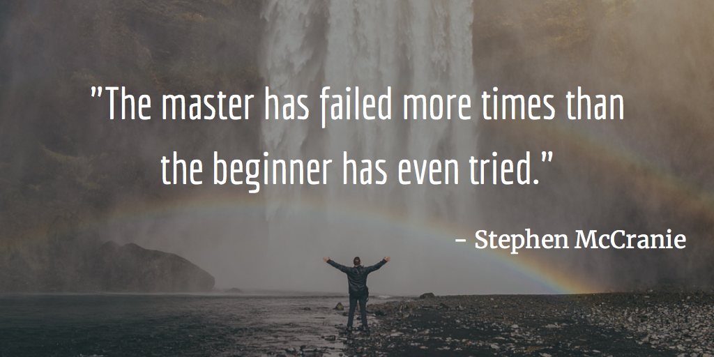

# iquotes 

> Get inspirational [quotes](https://en.wikipedia.org/wiki/Quote)

[](https://travis-ci.org/banminkyoz/iquotes) [](http://badge.fury.io/js/iquotes) [](https://github.com/xojs/xo)

<p align="center">
  
</p>

## Introduction

API of inspirational >280 quotes (Carefully collected) with 3 category:

* Life (~160 quotes)
* Love (~100 quotes)
* Development (~20 quotes)

## Install

```
$ npm install iquotes
```

## Usage

```js
const iquotes = require('iquotes');

iquotes.random();
// {
//   "quote": "The master has failed more times than the beginner has even tried.",
//   "author": "Stephen McCranie",
//   "category": "Life"
// }

// View API for more usage
```

## API

### .all(category: string = 'all'): object[]

Get list of all quotes by [categories](#supported-categories)

```js
iquotes.all('life');
// or
iquotes.all(); // To get all quotes

// [
//   {
//     "quote": "The master has failed more times than the beginner has even tried.",
//     "author": "Stephen McCranie",
//     "category": "Life"
//   },
//   {...},
//   ...
// ]
```

### .random(category: string = 'all'): object

Get random quotes from all quotes or by [cagegories](#supported-categories)

```js
iquotes.random(); 
// or
iquotes.random('life'); // To get random life quotes

// {
//   "quote": "The master has failed more times than the beginner has even tried.",
//   "author": "Stephen McCranie",
//   "category": "Life"
// }
```

### .count(category: string = 'all'): number

Get number of all quotes or number of quotes by [categories](#supported-categories)

```js
iquotes.count();
// 280
iquotes.count('love');
// 100
```

### .countDetail(): object[]

Get detail number of all [categories](#supported-categories)

```js
iquotes.countDetail();

// [
//   { type: 'life', count: 162 },
//   { type: 'love', count: 100 },
//   { type: 'dev', count: 18 },
//   { type: 'all', count: 280 } 
// ]
```

### .categories(): string[]

Get [supported categories list](#supported-categories)

```js
iquotes.categories();

// ['life', 'love', 'dev', 'all'];
```

## Supported Categories

- `life`
- `love`
- `dev` (Development)
- `all` - Default (If not provide any categories or provide `all`)

## Related

- [iquotes-cli](https://github.com/banminkyoz/iquotes-cli) - Cool CLI for this module 

## License

MIT © [Kyoz](mailto:banminkyoz@gmail.com)